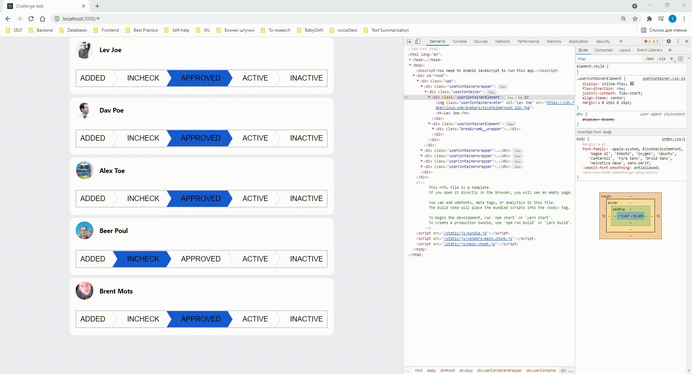
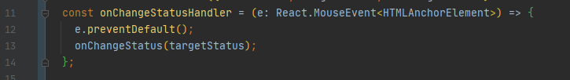
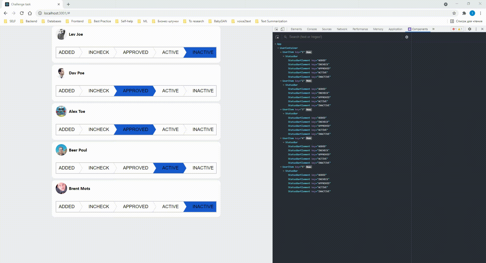

# Frontend-challenge description

Workmotion (www.workmotion.com) is a global HR platform enabling companies to hire & onboard their employees internationally, at the push of a button. It is our mission to create opportunities for anyone to work from anywhere. As work is becoming even more global and remote, there has never been a bigger chance to build a truly global HR-tech company.

As a part of our frontend engineering team, you will be responsible for building our core platform frontend 

We're currently developing an employees managment system.

The employee have four different states including the following
- ADDED
- IN-CHECK
- APPROVED
- ACTIVE
- INACTIVE

Your task is to build a frontend application using React / Typescript including the following features.

- A simple UI listing the employees 
  The application need to use an API endpoint to retrieve the employee's list, Unfortunately the API endpoint isn't developed yet, We recommend using a tool to mock your API with the following specification :
  - GET /employees/
  - POST /employees/
  - PATCH /employees/{employee_id}
 
- In Every employee row, there should be a component as per the provided picture which will be used to display the current state of this employee and by clicking on another state e.g. APPROVED , it should persist that change to this given employee.

# Solution description

🐥 Play with me: [Interactive demo](https://eloquent-wescoff-d5bbdd.netlify.app/)

First of all, I considered the StatusBar layout and implemented it as a functional component that uses the User object, changing the state of a particular person. A good tone would be to use Redux/Recoil.
The implementation of this component includes not only CSS/HTML, but also the application of architectural solutions of the application, the use of type annotation, the implementation of interfaces, solving the problem of data desynchronization in different sections of the frontend application.

The next step is to develop a custom container that contains a status bar, some information about the user, and interacts with the mocked API.
How do I save information about each user? I developed it with updating local states and requesting an API. In production
, of course, these will be asynchronous requests. The syntax of asynchronous functions can be with `async/wait` or `promises`.

To avoid bug with scroll when clicking on <a> element, I used prevent-default trick:

## Improve render performance 

Only one component is re-rendered for each click:

# How to use it

In the project directory, you can run:

### `yarn start`

Runs the app in the development mode.\
Open [http://localhost:3000](http://localhost:3000) to view it in the browser.

The page will reload if you make edits.\
You will also see any lint errors in the console.

### `yarn test`

Launches the test runner in the interactive watch mode.\
See the section about [running tests](https://facebook.github.io/create-react-app/docs/running-tests) for more information.

### `yarn build`

Builds the app for production to the `build` folder.\
It correctly bundles React in production mode and optimizes the build for the best performance.

The build is minified and the filenames include the hashes.\
Your app is ready to be deployed!

See the section about [deployment](https://facebook.github.io/create-react-app/docs/deployment) for more information.

### Knowledge base:
- [Indicators (demo)](https://codyhouse.co/demo/breadcrumbs-multi-steps-indicator/index.html#0)
- [CSS rounded triangles trick](https://codyhouse.co/blog/post/css-rounded-triangles-with-clip-path)
- [Lifting state up](reactjs.org/docs/lifting-state-up.html)
